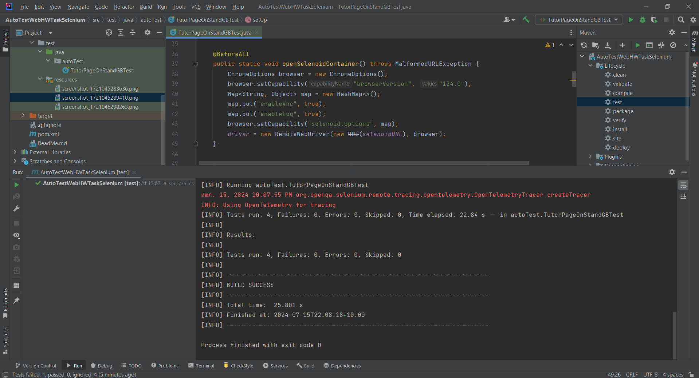
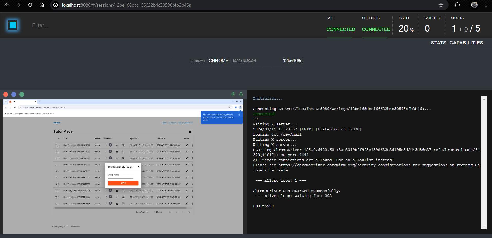

# Семинар: Selenoid
## Задание 1. 
Реализовать запуск тестов через Selenoid в проекте со второй лекции/семинара (Selenium). 
Условие для задания 1:
- Вернуться к проекту по итогам Семинара №2 - Selenium тесты
- Перенастроить создание драйвера для возможности запускать тесты в Selenoid контейнерах
В качестве решения приложить код (с изменениями в Before методах) и скриншоты успешного 
запуска тестов из Selenoid

================================================================================
## Test-Run проекта:

--------------------------------------------------
##  Docker Selenoid UI from Selenium:

